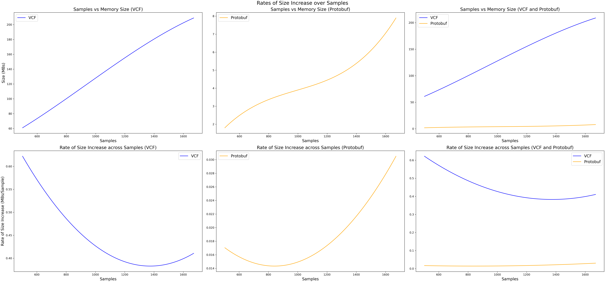

# Auspice Filtering and Space Complexity Plotting Code:

The notebook ```BME230A Final Project Data Visualization Notebook.ipynb``` in this directory was used to:

1. ) Parse sample metadata from NCBI Datasets metadata JSONs into CSVs  usable 
by the Auspice Tree viewer. Features which I wanted to filter on were strains and strain groups. The files ```dataset_catalog(NCBIDS).json``` and ```first_sequence_report.jsonl``` are the typical metadata files you get when downloading with NCBI Datasets. They are in this directory for convenience.

2. ) Plot size vs sample data collected from the creation of VCF matrix files and Protobuf tree files. These plots will show how greatly the sizes and space complexities of these two data types differ, although they are used for such similar purposes.

</img>
*Analysis on size trends of VCF and Protobuf MAT files using the same data on 1671 complete S. Aureus genome sequences. The first row is an analysis of file size plotted against number of samples used. The second row is an analysis of the rate of file size growth over the number of samples used. Each column corresponds to a focus on VCFs, Protobuf MATs, and both respectively. Size information was collected in cumulative 500 sample intervals. Benefits of low size from Protobuf MATs is made most clear in the last column.


