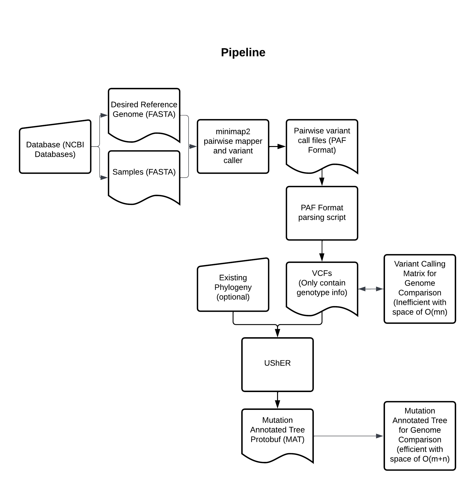

# Variant Calling Pipeline for Whole Bacterial Genome Sequences

# Description:

This is a pipeline for performing variant calling with whole haploid genomes in fasta format. Output is a single VCF containing variant calls on all samples given as input to a reference genome. Pipeline makes use of [Minimap2](https://github.com/lh3/minimap2) for pairwise sequence alignment mapping and [paftools.js](https://github.com/lh3/minimap2/blob/master/misc/paftools.js) (from the Minimap2 toolkit) for variant calling. The main pipeline is wrapped in Snakemake and dependencies are handled with a conda environment. Both can be found and used in [paf-VCF](/paf-VCF/).

</img>

*Flowchart of variant calling pipeline. Scheme was used in generating a S. Aureus Phylogeny using 1671 completed and annotated genome samples from the NCBI Database. See [Applications with UShER](#app_anchor) for more details on a test example.*

# Contents:

## 1.) Data Visualization:
- Code for parsing sample metadata from NCBI Datasets to be view with MATs in Auspice
- Code for plotting the space complexity analysis data I found when comparing VCFs to Protobufs in this project
## 2.) paf-VCF pipeline:
- A pipeline wrapped in snakemake and a conda environment which can be used
    to perform variant calling beginning with a set of sample whole genome sequences
    and a reference. For now it should be assumed that it only works with unphased 
    single chromosome organisms as this was made for my purposes. Also note that 
    variants are called in the form of only SNPs as errors occurred in the VCF merging
    process when long insertions were counted. This was remedied with BCFtools norm
    which I still need to do more research on. A key component to this pipeline 
    is the Minimap2 toolkit and paftools.js by lh3.

# Applications with UShER for Phylogeny Construction and Sample Placement:

Output from variant calling with this pipeline is given in the VCF file format. VCFs can be used to construct a Mutation Annotated Tree (MAT) with the [Ultrafast Sample placement on Existing tRees (UShER)](https://usher-wiki.readthedocs.io/en/latest/UShER.html). UShER extracts sufficient sample/variant calling information to construct a MAT through maximum parsimony based sample placement. These MATs are created in the Google Protocol Buffer data format. Protocall Buffer MATs are concise datastructures which make empirically constructed phylogenies viable and portable. UShER's suite of tools, [matUtils](https://usher-wiki.readthedocs.io/en/latest/matUtils.html) offers a variety of features for exporting Protocall Buffer MATs into other usable forms such as the JSON and Newick (.nh) formats.

vsNCTC.PNG)
*Auspice Visualization of a S. Aureus phylogeny composed of 1671 completed and annotated genomes and generated using UShER. Highlighted are samples from the NCTC (UK) and USA-SUR (USA) strain groups. USA-SUR samples are highlighted in bold blue between the 6000-8000 ticks for units of divergence (SNPs). Unbolded blue points represent NCTC (UK) samples.Placement of these UK and USA samples may display evidence of a past HGT event granting methicillin resistance to USA S. Aureus strains. In literature, USA MRSA strains descended from Europe shortly after the introuction of methicilin and evolved in parallel to Eurpoean strains. Data collected from the NCBI Database with the NCBI Datasets toolkit.*
